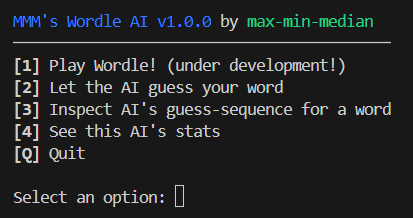
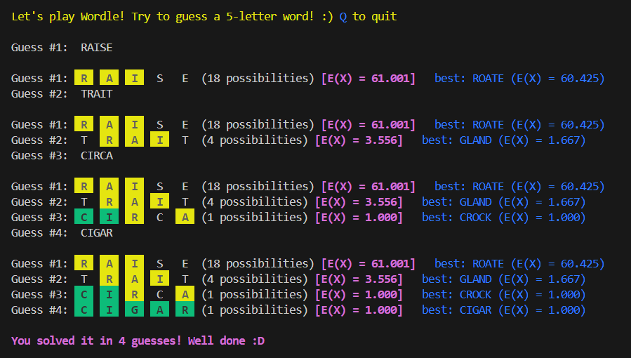
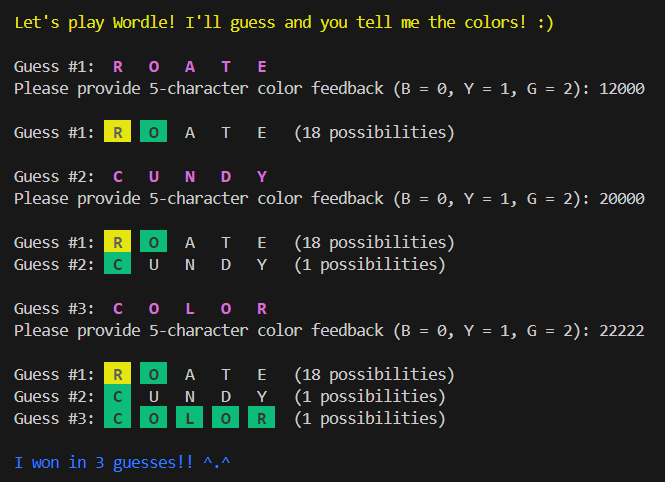
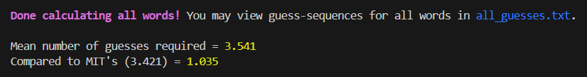

# wordle-AI

An AI coded in `Node.js` to solve the word game [Wordle](https://www.nytimes.com/games/wordle/index.html), which exploded in popularity in 2022.

This solver is (only) `3.5%` worse than [MIT's](https://auction-upload-files.s3.amazonaws.com/Wordle_Paper_Final.pdf) solver, a playable version of which can be found [here](http://wordle-page.s3-website-us-east-1.amazonaws.com/).

## Instructions

Clone this repository, then run
```
node wordle.js
```


---
### [1] Player mode


In Player mode, you try to guess a random word chosen from 2,315 possible words. However, this version comes with a trainer: You will be able to see the expected list size that would result from guessing your word, as well as the AI's recommended word and expected list size. Lower = Better!

Special commands:  
- `L` : list of all possible solution words at this point in the game.
- `G` : Give up the current round.
- `Q` : Quit to the main menu

---
### [2] AI mode


In AI mode, the computer plays and you 'host' the game!!
Select a 5-letter solution word and provide the computer with color-coded feedback for each of its guesses. Green = `G` = `2`, Yellow = `Y` = `1`, Black = `B` = `0`. Examples of suitable feedback:

> ✅ `BBYYB` (3rd and 4th positions yellow)  
✅ `GBBYB`  
✅ `20010` (equivalent to `GBBYB`)  
✅ `2BB21` (you may mix and match)  
❌ `32123` (`3` is invalid)  
❌ `ABRYE`

Special commands:  
- `Q` : Quit to the main menu
---
### [3] Word Query

You may find out how the AI would guess a particular word. This displays the sequence of guesses that the AI would go through to solve that word.

---
### [4] AI Statistics


Calculates the average number of guesses required to guess every single word in the solution list (of 2,315 words). This is compared to MIT's optimal Wordle solver.

I'm pleased to say that my 'peasant AI' is **only 3.5% worse** than MIT's premium algorithm! 🦾🤖🦾

## Dependencies
- None

## Algorithm
As Wordle has been proven to be NP-hard, a peasant (like me) without massive computational resources has to plan carefully to even have a chance of a feasible algorithm which won't take 5 years to run. Therefore I chose a statistical / probabilistic approach, rather than exact game tree search algorithms.

There are 12-14K 'guessable' words (see `guessable.txt`) but only 2,315 solution words (see `answers.txt`).

Given a 'current word list' (a sublist of the 2,315 solution words), and the list of all guessables, first note that guessing any 'guessable' word will 'partition' the entire 'current word list' into many 'buckets' (up to 238). This is due to there being `3^5 - 5 = 238` possible ways to "color-code" the guessword (3 possible colors per slot for 5 slots, but we subtract 5 since we cannot get GGGGY and its permutations). Now we do the following:
```
For each of the 14K guessable words,
    For each word in the current word list
        - Get the color coding obtained by guessing this word.
        - Place this word into the respective bucket.
        - Now, compute the expected size of our new sublist if we were to guess this word (See example below).
        - Keep track of which guessword gives the smallest expected size.
```

---
### Example

Suppose you have narrowed it down to 6 possible words.

---
**Case (A)**: `'ABCDE'`

Suppose this bucketizes the words into `{1, 1, 1, 1, 1, 1}`. Clearly this is the best situation; this word creates 6 possible responses and we will be able to end the game using at most 1 more guess. We get a small bonus if 'ABCDE' is itself a solution word, so we check for and use that as a tie-breaker. The expectation is calculated as follows:

 `1(1/6) + 1(1/6) + 1(1/6) + 1(1/6) + 1(1/6) + 1(1/6) = 1`

which makes sense as you need exactly 1 more guess.

---
**Case (B)**: `'FGHIJ'`

Suppose this bucketizes the words into `{2, 2, 2}`. It's not as ideal as before. Now, the expectation is calculated as follows:

 `2(2/6) + 2(2/6) + 2(2/6) = 2`

**Case (C)**: `'KLMNO'`

Suppose this bucketizes the words into `{2, 4}`. Now, the expectation is calculated as follows:

 `2(2/6) + 4(4/6) = 20/6 = 10/3`

---
Notice that we can simplify the calculation by finding the sum of squares of the sizes of each bucket, followed by dividing by the length of the (current) sublist of solutions.

## What is the best starting word?

The supposed best starting word is `SALET` according to the MIT guys.  
However, my AI says it's `ROATE`, so that's what it uses.
`¯\_(ツ)_/¯`

| | MIT's | MMM's |
| --- | :---: | :---: |
| Avg # Guesses| `3.421` | `3.541` (+3.5%) |
